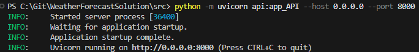
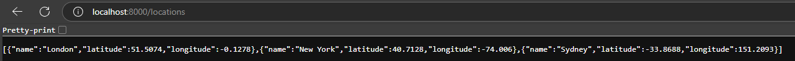
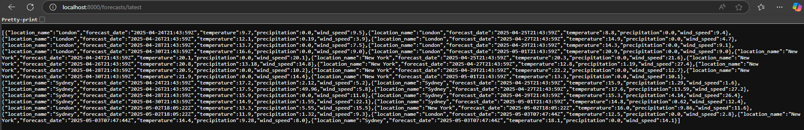
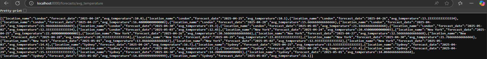
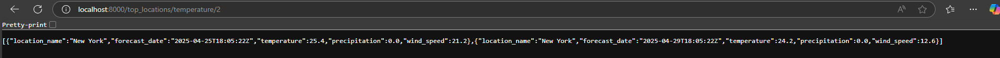
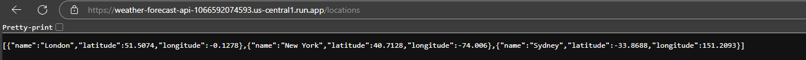
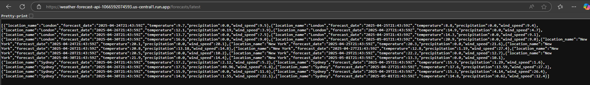
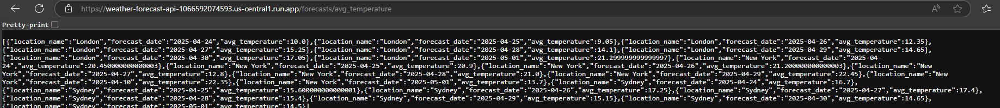

# Weather Forecast Application

## Prerequisites
- Python 3.9+
- SQLite
- Docker (optional, for containerized deployment)
- Meteomatics API credentials (username and password)

## Installation
1. Clone the repository:
```bash
git clone
cd weather_forecast_solution
```
or

Unzip the .zip file

2. Install dependencies:
```
pip install -r src/requirements.txt
Install SQLite3
```

3. Set up Meteomatics credentials:
   - Replace my credentials with yours (or not)

## Running the Application
1. Fetch and store weather data (make sure you are in the src folder path in terminal):

```bash
python main.py
```

2. Start the API server:

```bash
python -m uvicorn api:app_API --host 0.0.0.0 --port 8000
```

3. Access the API endpoints:
   - List locations: `GET http://localhost:8000/locations`
   
   - Latest forecasts: `GET http://localhost:8000/forecasts/latest`
   
   - Average temperature: `GET http://localhost:8000/forecasts/avg_temperature`
   
   - Top n locations by metric: `GET http://localhost:8000/top_locations/{metric}/{n}` (e.g., `/top_locations/temperature/2`)
   

## Database
- The application uses SQLite (`weather.db`).
- Schema is defined in `src/create_tables.sql`.
- Export tables to CSV using `sqlite3 weather.db -init src/export_tables.sql`.

## Cloud Deployment
Find below all accessible API data as well on deployed on Google Cloud Services:
   - List locations: `GET https://weather-forecast-api-1066592074593.us-central1.run.app/locations`
   
   - Latest forecasts: `GET https://weather-forecast-api-1066592074593.us-central1.run.app/forecasts/latest`
   
   - Average temperature: `GET https://weather-forecast-api-1066592074593.us-central1.run.app/forecasts/avg_temperature`
   
   - Top n locations by metric: `GET https://weather-forecast-api-1066592074593.us-central1.run.app/top_locations/{metric}/{n}` (e.g., `/top_locations/temperature/5`)
   

## Notes
- The application fetches 7-day forecasts for London, New York, and Sydney.
- The database stores temperature, precipitation, and wind speed.
- API endpoints are documented via FastAPI's OpenAPI interface at `http://localhost:8000/docs` or on Google Cloud at `https://weather-forecast-api-1066592074593.us-central1.run.app/docs`.


## Support
- In case you require any assistance or face any issues retreiving the results do not hesitate to contact me! :)